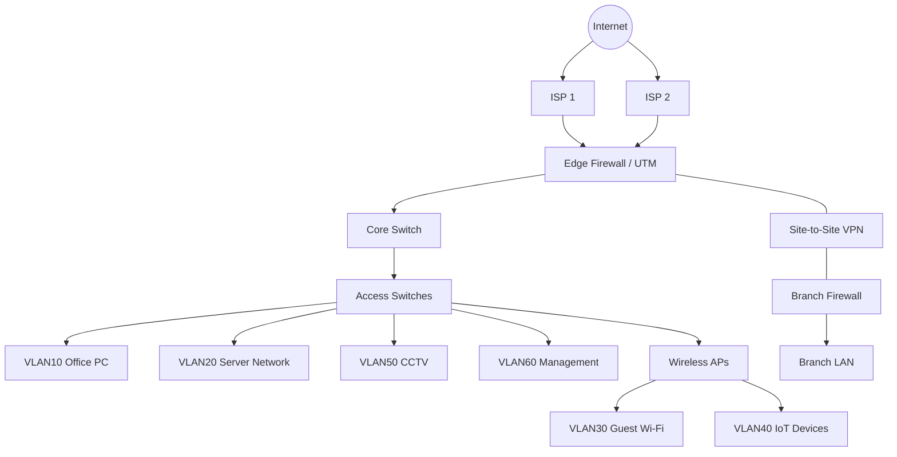
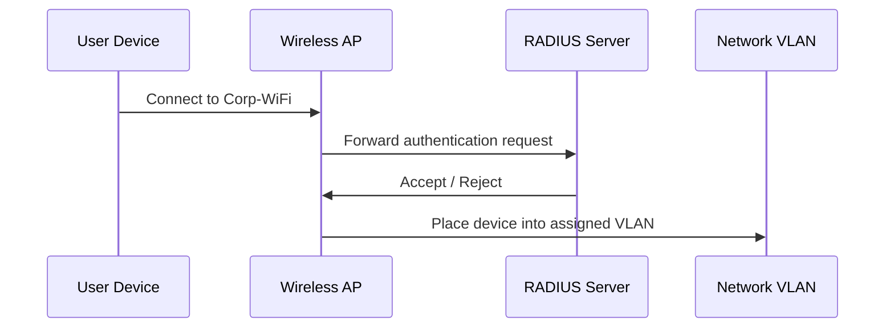

# 企業網路安全分段與防禦架構設計

> 一個防禦型資安作品集專案，用於展示企業網路分段、防火牆政策設計、遠端站點 VPN、日誌記錄，以及基礎安全維運能力。

## 1. Project Overview

本專案展示一個適用於中型企業環境的安全企業網路設計。  
設計重點包含 VLAN 分段、最小權限防火牆規則、管理網段隔離、訪客網路隔離、Site-to-Site VPN 連線，以及基礎監控與日誌記錄實務。

這是一個以 Lab 為基礎的文件型作品集專案。所有 IP 位址、規則、名稱與設定皆為範例資料，不代表任何真實公司環境。

## 2. Project Goals

本專案目標如下：

- 設計具備網路分段概念的企業網路架構。
- 分離使用者、伺服器、訪客、IoT、CCTV 與管理流量。
- 降低內部網路中的橫向移動風險。
- 依據最小權限原則建立防火牆政策。
- 提供分公司使用的基礎 Site-to-Site VPN 設計。
- 定義日誌記錄、監控與基礎事件應變考量。
- 展示 IT Infrastructure 與資安維運職位所需的文件撰寫能力。

## 3. Target Environment

| Item | Description |
|---|---|
| Company size | 300 位使用者 |
| Main office | HQ |
| Branch office | 遠端站點 |
| Internet links | 雙 ISP 線路 |
| Core security device | 次世代防火牆 |
| Switching | Layer 2 / Layer 3 管理型交換器 |
| Wireless | 企業 Wi-Fi、訪客 Wi-Fi、IoT SSID |
| Authentication | RADIUS / 802.1X 概念 |
| Monitoring | Syslog、防火牆日誌、基礎告警檢視 |

## 4. High-Level Network Topology



## 5. VLAN and IP Address Plan

| VLAN ID | VLAN Name | Subnet | Purpose | Security Level |
|---:|---|---|---|---|
| 10 | Office-PC | 10.10.10.0/24 | 員工電腦使用 | Medium |
| 20 | Server | 10.10.20.0/24 | 內部應用程式與檔案伺服器 | High |
| 30 | Guest-WiFi | 10.10.30.0/24 | 僅提供訪客上網使用 | Low |
| 40 | IoT | 10.10.40.0/24 | 智慧電視、印表機、會議室設備 | Low |
| 50 | CCTV | 10.10.50.0/24 | IP 攝影機與 NVR | Medium |
| 60 | Management | 10.10.60.0/24 | 防火牆、交換器、AP、NVR 管理 | Critical |
| 70 | VPN-Users | 10.10.70.0/24 | 遠端 VPN 使用者 | Medium |
| 80 | DMZ | 10.10.80.0/24 | 對外服務或隔離服務區 | High |

## 6. Segmentation Strategy

網路透過分段設計，減少不同資產群組之間不必要的連線與流量。

### 6.1 Office-PC Network

辦公室使用者可存取必要的內部服務，例如 DNS、檔案伺服器、應用程式伺服器與網際網路。  
禁止一般使用者直接存取管理介面。

### 6.2 Server Network

伺服器網段採用較嚴格的存取控制保護。  
僅允許使用者網段存取必要服務埠，例如 HTTPS、SMB、DNS 或特定應用程式連接埠。

### 6.3 Guest Wi-Fi

訪客 Wi-Fi 僅提供網際網路存取。  
訪客端設備不得存取內部 VLAN、防火牆管理介面、交換器、伺服器、印表機、CCTV 或 IoT 設備。

### 6.4 IoT Network

IoT 設備因通常具備較弱的安全控制，因此獨立分離至專用網段。  
IoT 設備僅可在必要情況下存取雲端服務或有限的內部服務。

### 6.5 CCTV Network

CCTV 攝影機僅能與 NVR 通訊。  
除授權的 IT 或資安人員外，一般使用者不應直接存取攝影機管理頁面。

### 6.6 Management Network

僅 IT 管理員工作站可存取管理 VLAN。  
此 VLAN 用於防火牆、交換器、AP、伺服器與基礎架構管理。

## 7. Firewall Policy Design

防火牆規則應遵循最小權限原則。  
預設的跨 VLAN 政策為拒絕，僅允許必要流量通過。

### 7.1 Sample Firewall Rule Matrix

| Rule ID | Source | Destination | Service | Action | Reason |
|---:|---|---|---|---|---|
| 1 | VLAN10 Office-PC | Internet | HTTP/HTTPS/DNS/NTP | Allow | 一般商務上網需求 |
| 2 | VLAN10 Office-PC | VLAN20 Server | Required application ports | Allow | 存取業務應用程式 |
| 3 | VLAN10 Office-PC | VLAN60 Management | Any | Deny | 防止未授權管理存取 |
| 4 | VLAN30 Guest-WiFi | Internet | HTTP/HTTPS/DNS | Allow | 訪客上網需求 |
| 5 | VLAN30 Guest-WiFi | RFC1918 private networks | Any | Deny | 訪客網路隔離 |
| 6 | VLAN40 IoT | Internet | Required cloud services | Allow | IoT 雲端連線需求 |
| 7 | VLAN40 IoT | VLAN20 Server | Any | Deny by default | 降低橫向移動風險 |
| 8 | VLAN50 CCTV | NVR server | RTSP/HTTPS/vendor-required ports | Allow | 攝影機錄影流量 |
| 9 | VLAN50 CCTV | Internet | Any | Deny by default | 避免攝影機暴露至網際網路 |
| 10 | VLAN60 Management | Network devices | SSH/HTTPS/SNMP | Allow | 網路設備管理 |
| 11 | VPN Users | VLAN20 Server | Required services only | Allow | 遠端工作存取 |
| 12 | Any internal VLAN | Firewall management | Any | Deny except IT admins | 保護防火牆管理介面 |

### 7.2 Recommended Default Policy

| Traffic Type | Default Action |
|---|---|
| LAN to Internet | 允許並搭配過濾 |
| Guest to LAN | 拒絕 |
| IoT to LAN | 除必要需求外拒絕 |
| CCTV to LAN | 除 NVR 相關流量外拒絕 |
| User VLAN to Management VLAN | 拒絕 |
| Management VLAN to devices | 允許 IT 管理員存取 |
| Inter-VLAN traffic | 預設拒絕，依例外需求允許 |

## 8. Site-to-Site VPN Design

公司分公司透過 Site-to-Site VPN 通道連線至 HQ。

### 8.1 VPN Requirements

| Item | Design |
|---|---|
| VPN type | IPsec site-to-site VPN |
| Authentication | 預先共用金鑰或憑證式驗證 |
| Encryption | AES-256 |
| Integrity | SHA-256 或更高強度 |
| Key exchange | IKEv2 |
| Routing | 依環境使用靜態路由或動態路由 |
| Logging | VPN 通道上線/中斷事件、驗證失敗事件 |

### 8.2 VPN Traffic Control

分公司僅應存取必要的 HQ 服務。

| Source | Destination | Service | Action |
|---|---|---|---|
| Branch LAN | HQ DNS | DNS | Allow |
| Branch LAN | HQ application server | HTTPS/Application ports | Allow |
| Branch LAN | HQ file server | SMB if required | Allow |
| Branch LAN | HQ Management VLAN | Any | Deny |
| HQ IT Admin | Branch network devices | SSH/HTTPS/SNMP | Allow |

## 9. Wireless Security Design

### 9.1 SSID Design

| SSID | VLAN | Authentication | Purpose |
|---|---:|---|---|
| Corp-WiFi | VLAN10 | WPA2/WPA3-Enterprise with RADIUS | 員工設備使用 |
| Guest-WiFi | VLAN30 | Captive portal or PSK | 訪客上網使用 |
| IoT-WiFi | VLAN40 | PSK or device-based control | IoT 設備使用 |

### 9.2 802.1X / RADIUS Concept

企業 Wi-Fi 應盡可能使用集中式身分驗證。



### 9.3 Wireless Security Controls

- 企業 Wi-Fi 使用 WPA2-Enterprise 或 WPA3-Enterprise。
- 停用弱加密與過時協定。
- 將訪客流量與內部網路分離。
- 針對企業、訪客與 IoT 無線流量使用不同 VLAN。
- 定期檢視驗證日誌。
- 移除未使用的 SSID。
- 非企業級 SSID 在人員異動時應更換共用金鑰。

## 10. Logging and Monitoring

### 10.1 Log Sources

| Log Source | Important Events |
|---|---|
| Firewall | 拒絕連線、VPN 事件、IPS/AV 事件、管理員登入 |
| Switches | 連接埠上線/離線、STP 變更、未授權 MAC 位址 |
| Wireless AP/Controller | 驗證失敗、Rogue AP 偵測、用戶端漫遊 |
| Servers | 登入失敗、權限變更、服務異常 |
| RADIUS | 驗證成功/失敗、使用者拒絕事件 |
| VPN | 通道上線/中斷、登入失敗、異常遠端存取 |

### 10.2 Basic Detection Use Cases

| Use Case | Detection Logic | Response |
|---|---|---|
| Brute-force login | 同一來源出現大量登入失敗 | 封鎖來源、重設密碼、檢視日誌 |
| Port scanning | 單一來源連線至多個連接埠 | 調查來源主機，若確認惡意則封鎖 |
| Guest access to LAN | 訪客 VLAN 嘗試連線至私有 IP 範圍 | 確認防火牆規則並阻擋流量 |
| Unauthorized admin access | 非 IT 主機嘗試存取管理 VLAN | 調查端點與使用者 |
| VPN abnormal login | 異常地點或異常時間登入 | 確認使用者身分並檢視帳號活動 |

## 11. Security Risk Assessment

| Risk | Impact | Likelihood | Risk Level | Mitigation |
|---|---|---:|---|---|
| Guest users access internal systems | 資料外洩 | Medium | High | 訪客 VLAN 隔離並拒絕 RFC1918 存取 |
| IoT devices become compromised | 橫向移動 | Medium | High | IoT VLAN 隔離與限制對外連線規則 |
| Weak firewall rules | 未授權存取 | Medium | High | 定期規則檢視與最小權限設計 |
| Exposed management interfaces | 設備遭入侵 | Low-Medium | High | 管理 VLAN 與管理員允許清單 |
| VPN credential compromise | 未授權遠端存取 | Medium | High | MFA、VPN 日誌與存取限制 |
| Inadequate logging | 事件應變延遲 | Medium | Medium | 集中式日誌與告警檢視 |
| Flat network design | 攻擊面擴大 | Medium | High | VLAN 分段與 ACL 控制 |

## 12. Implementation Checklist

### 12.1 Network Segmentation

- [ ] 建立使用者、伺服器、訪客、IoT、CCTV 與管理 VLAN。
- [ ] 為每個 VLAN 指派 IP 子網。
- [ ] 設定使用者網段所需的 DHCP 範圍。
- [ ] 確認每個 VLAN 的預設閘道。
- [ ] 套用 VLAN 之間的防火牆政策。
- [ ] 測試訪客網路隔離。
- [ ] 測試 IoT 存取限制。
- [ ] 測試 CCTV 僅能與 NVR 通訊。

### 12.2 Firewall

- [ ] 設定 WAN 介面。
- [ ] 設定 LAN/VLAN 介面。
- [ ] 建立位址物件。
- [ ] 建立服務物件。
- [ ] 套用跨 VLAN 預設拒絕政策。
- [ ] 僅允許必要的業務服務。
- [ ] 啟用拒絕流量日誌。
- [ ] 每季檢視防火牆規則。

### 12.3 VPN

- [ ] 設定 IPsec VPN 通道。
- [ ] 定義本地與遠端子網。
- [ ] 設定加密與完整性演算法。
- [ ] 套用 VPN 防火牆政策。
- [ ] 測試分公司至 HQ 的連線。
- [ ] 啟用 VPN 事件日誌。

### 12.4 Wireless

- [ ] 建立 Corp-WiFi、Guest-WiFi 與 IoT-WiFi SSID。
- [ ] 將每個 SSID 對應至正確 VLAN。
- [ ] 為企業 Wi-Fi 設定 RADIUS 驗證。
- [ ] 測試使用者驗證。
- [ ] 確認訪客 Wi-Fi 無法存取內部系統。
- [ ] 檢視驗證失敗日誌。

### 12.5 Logging

- [ ] 啟用防火牆流量日誌。
- [ ] 啟用 VPN 日誌。
- [ ] 啟用無線驗證日誌。
- [ ] 啟用交換器系統日誌。
- [ ] 將重要日誌轉送至 Syslog Server 或 SIEM。
- [ ] 定義告警檢視流程。

## 13. Validation Test Plan

| Test Case | Expected Result |
|---|---|
| Guest Wi-Fi accesses internet | 成功 |
| Guest Wi-Fi accesses internal server | 阻擋 |
| Office PC accesses application server | 成功 |
| Office PC accesses firewall management page | 阻擋，除非為 IT 管理員 |
| IoT device accesses internet cloud service | 若有必要需求則成功 |
| IoT device accesses server VLAN | 阻擋 |
| CCTV camera accesses NVR | 成功 |
| CCTV camera accesses internet | 預設阻擋 |
| VPN user accesses allowed server | 成功 |
| VPN user accesses management VLAN | 阻擋，除非為 IT 管理員 |

## 14. Documentation Artifacts

此 Repository 包含：

```text
enterprise-network-security-lab/
├── README.md
├── docs/
│   ├── firewall-policy.md
│   ├── implementation-checklist.md
│   ├── logging-and-monitoring.md
│   ├── risk-assessment.md
│   ├── site-to-site-vpn.md
│   ├── vlan-ip-plan.md
│   └── wireless-security.md
├── topology/
│   └── topology-mermaid.md
└── sample-config/
    └── firewall-rules-sample.csv
```

## 15. Skills Demonstrated

本專案展示以下能力：

- 企業網路設計
- VLAN 與子網規劃
- 防火牆政策設計
- 最小權限存取控制
- 訪客網路隔離
- IoT 與 CCTV 網路分段
- Site-to-Site VPN 規劃
- 無線網路安全與 RADIUS/802.1X 概念
- 資安風險評估
- IT 文件與維運檢查表撰寫
- 基礎 SOC / 日誌監控思維

## 16. Disclaimer

本專案僅供學習與作品集展示使用。  
所有 IP 位址、拓撲圖、防火牆規則與設定皆為範例資料。  
