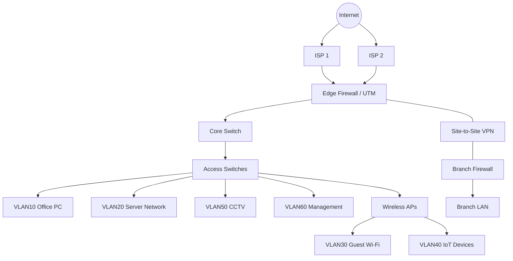
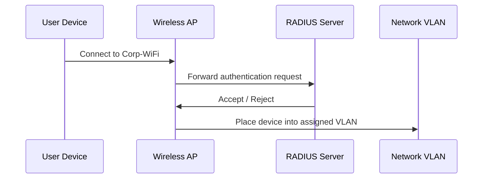

# Enterprise Network Security Lab

> A defensive security portfolio project for enterprise network segmentation, firewall policy design, remote site VPN, logging, and basic security operations.

## 1. Project Overview

This project demonstrates a secure enterprise network design for a mid-sized company environment.  
The design focuses on VLAN segmentation, least-privilege firewall rules, management network isolation, guest network separation, site-to-site VPN connectivity, and basic monitoring/logging practices.

This is a lab-based documentation project. All IP addresses, rules, names, and configurations are sample data and do not represent any real company environment.

## 2. Project Goals

The goals of this project are:

- Design a segmented enterprise network architecture.
- Separate user, server, guest, IoT, CCTV, and management traffic.
- Reduce lateral movement risk inside the internal network.
- Create firewall policies based on least privilege.
- Provide a basic site-to-site VPN design for a branch office.
- Define logging, monitoring, and basic incident response considerations.
- Demonstrate documentation ability for IT infrastructure and security operations roles.

## 3. Target Environment

| Item | Description |
|---|---|
| Company size | 300 users |
| Main office | HQ |
| Branch office | Remote site |
| Internet links | Dual ISP |
| Core security device | Next-generation firewall |
| Switching | Layer 2/Layer 3 managed switches |
| Wireless | Corporate Wi-Fi, Guest Wi-Fi, IoT SSID |
| Authentication | RADIUS / 802.1X concept |
| Monitoring | Syslog, firewall logs, basic alert review |

## 4. High-Level Network Topology



## 5. VLAN and IP Address Plan

| VLAN ID | VLAN Name | Subnet | Purpose | Security Level |
|---:|---|---|---|---|
| 10 | Office-PC | 10.10.10.0/24 | Employee computers | Medium |
| 20 | Server | 10.10.20.0/24 | Internal application/file servers | High |
| 30 | Guest-WiFi | 10.10.30.0/24 | Guest internet access only | Low |
| 40 | IoT | 10.10.40.0/24 | Smart TVs, printers, meeting room devices | Low |
| 50 | CCTV | 10.10.50.0/24 | IP cameras and NVR | Medium |
| 60 | Management | 10.10.60.0/24 | Firewall, switches, APs, NVR management | Critical |
| 70 | VPN-Users | 10.10.70.0/24 | Remote VPN users | Medium |
| 80 | DMZ | 10.10.80.0/24 | Public-facing or isolated services | High |

## 6. Segmentation Strategy

The network is segmented to reduce unnecessary communication between different asset groups.

### 6.1 Office-PC Network

Office users can access required internal services such as DNS, file server, application server, and internet access.  
Direct access to management interfaces is denied.

### 6.2 Server Network

The server network is protected with stricter access control.  
Only required ports from user networks are allowed, such as HTTPS, SMB, DNS, or application-specific ports.

### 6.3 Guest Wi-Fi

Guest Wi-Fi is internet-only.  
Guest clients must not access internal VLANs, firewall management interfaces, switches, servers, printers, CCTV, or IoT devices.

### 6.4 IoT Network

IoT devices are separated because they often have weaker security controls.  
IoT devices can only access required cloud services and limited internal services when necessary.

### 6.5 CCTV Network

CCTV cameras can communicate with the NVR only.  
Users should not directly access camera management pages unless they are authorized IT/security personnel.

### 6.6 Management Network

Only IT admin workstations can access the management VLAN.  
This VLAN is used for firewall, switch, AP, server management, and infrastructure administration.

## 7. Firewall Policy Design

Firewall rules should follow the principle of least privilege.  
The default inter-VLAN policy is deny, and only required traffic is allowed.

### 7.1 Sample Firewall Rule Matrix

| Rule ID | Source | Destination | Service | Action | Reason |
|---:|---|---|---|---|---|
| 1 | VLAN10 Office-PC | Internet | HTTP/HTTPS/DNS/NTP | Allow | Normal business access |
| 2 | VLAN10 Office-PC | VLAN20 Server | Required application ports | Allow | Business application access |
| 3 | VLAN10 Office-PC | VLAN60 Management | Any | Deny | Prevent unauthorized admin access |
| 4 | VLAN30 Guest-WiFi | Internet | HTTP/HTTPS/DNS | Allow | Guest internet access |
| 5 | VLAN30 Guest-WiFi | RFC1918 private networks | Any | Deny | Guest isolation |
| 6 | VLAN40 IoT | Internet | Required cloud services | Allow | IoT cloud connectivity |
| 7 | VLAN40 IoT | VLAN20 Server | Any | Deny by default | Reduce lateral movement |
| 8 | VLAN50 CCTV | NVR server | RTSP/HTTPS/vendor-required ports | Allow | Camera recording |
| 9 | VLAN50 CCTV | Internet | Any | Deny by default | Prevent camera exposure |
| 10 | VLAN60 Management | Network devices | SSH/HTTPS/SNMP | Allow | Device administration |
| 11 | VPN Users | VLAN20 Server | Required services only | Allow | Remote work access |
| 12 | Any internal VLAN | Firewall management | Any | Deny except IT admins | Protect firewall |

### 7.2 Recommended Default Policy

| Traffic Type | Default Action |
|---|---|
| LAN to Internet | Allow with filtering |
| Guest to LAN | Deny |
| IoT to LAN | Deny unless required |
| CCTV to LAN | Deny unless NVR-related |
| User VLAN to Management VLAN | Deny |
| Management VLAN to devices | Allow for IT admins |
| Inter-VLAN traffic | Deny by default, allow by exception |

## 8. Site-to-Site VPN Design

The company has a branch office connected to HQ through a site-to-site VPN tunnel.

### 8.1 VPN Requirements

| Item | Design |
|---|---|
| VPN type | IPsec site-to-site VPN |
| Authentication | Pre-shared key or certificate-based authentication |
| Encryption | AES-256 |
| Integrity | SHA-256 or stronger |
| Key exchange | IKEv2 |
| Routing | Static route or dynamic routing depending on environment |
| Logging | VPN tunnel up/down events, authentication failures |

### 8.2 VPN Traffic Control

The branch office should only access required HQ services.

| Source | Destination | Service | Action |
|---|---|---|---|
| Branch LAN | HQ DNS | DNS | Allow |
| Branch LAN | HQ application server | HTTPS/Application ports | Allow |
| Branch LAN | HQ file server | SMB if required | Allow |
| Branch LAN | HQ Management VLAN | Any | Deny |
| HQ IT Admin | Branch network devices | SSH/HTTPS/SNMP | Allow |

## 9. Wireless Security Design

### 9.1 SSID Design

| SSID | VLAN | Authentication | Purpose |
|---|---:|---|---|
| Corp-WiFi | VLAN10 | WPA2/WPA3-Enterprise with RADIUS | Employee devices |
| Guest-WiFi | VLAN30 | Captive portal or PSK | Guest internet access |
| IoT-WiFi | VLAN40 | PSK or device-based control | IoT devices |

### 9.2 802.1X / RADIUS Concept

Corporate Wi-Fi should use centralized authentication where possible.



### 9.3 Wireless Security Controls

- Use WPA2-Enterprise or WPA3-Enterprise for corporate Wi-Fi.
- Disable weak encryption and legacy protocols.
- Separate guest traffic from internal networks.
- Use different VLANs for corporate, guest, and IoT wireless traffic.
- Review authentication logs regularly.
- Remove unused SSIDs.
- Rotate shared keys for non-enterprise SSIDs when staff changes occur.

## 10. Logging and Monitoring

### 10.1 Log Sources

| Log Source | Important Events |
|---|---|
| Firewall | Denied traffic, VPN events, IPS/AV events, admin login |
| Switches | Port up/down, STP changes, unauthorized MAC addresses |
| Wireless AP/Controller | Authentication failures, rogue AP detection, client roaming |
| Servers | Login failures, privilege changes, service failures |
| RADIUS | Authentication success/failure, rejected users |
| VPN | Tunnel up/down, login failures, unusual remote access |

### 10.2 Basic Detection Use Cases

| Use Case | Detection Logic | Response |
|---|---|---|
| Brute-force login | Many failed logins from same source | Block source, reset password, review logs |
| Port scanning | One source connects to many ports | Investigate source, block if malicious |
| Guest access to LAN | Guest VLAN traffic toward private IP ranges | Verify firewall rule, block traffic |
| Unauthorized admin access | Non-IT host tries to access management VLAN | Investigate endpoint and user |
| VPN abnormal login | Login from unusual location or time | Verify user identity and review account |

## 11. Security Risk Assessment

| Risk | Impact | Likelihood | Risk Level | Mitigation |
|---|---|---:|---|---|
| Guest users access internal systems | Data leakage | Medium | High | Guest VLAN isolation, deny RFC1918 access |
| IoT devices become compromised | Lateral movement | Medium | High | IoT VLAN, restricted outbound rules |
| Weak firewall rules | Unauthorized access | Medium | High | Rule review, least privilege |
| Exposed management interfaces | Device compromise | Low-Medium | High | Management VLAN, admin allowlist |
| VPN credential compromise | Unauthorized remote access | Medium | High | MFA, VPN logs, restricted access |
| Inadequate logging | Delayed incident response | Medium | Medium | Centralized logs and alert review |
| Flat network design | Large attack surface | Medium | High | VLAN segmentation and ACLs |

## 12. Implementation Checklist

### 12.1 Network Segmentation

- [ ] Create VLANs for users, servers, guest, IoT, CCTV, and management.
- [ ] Assign IP subnets to each VLAN.
- [ ] Configure DHCP scopes for each user-facing VLAN.
- [ ] Confirm default gateway for each VLAN.
- [ ] Apply firewall policies between VLANs.
- [ ] Test guest isolation.
- [ ] Test IoT restrictions.
- [ ] Test CCTV-to-NVR communication only.

### 12.2 Firewall

- [ ] Configure WAN interfaces.
- [ ] Configure LAN/VLAN interfaces.
- [ ] Create address objects.
- [ ] Create service objects.
- [ ] Apply deny-by-default inter-VLAN policy.
- [ ] Allow only required business services.
- [ ] Enable logging for denied traffic.
- [ ] Review firewall rules every quarter.

### 12.3 VPN

- [ ] Configure IPsec VPN tunnel.
- [ ] Define local and remote subnets.
- [ ] Configure encryption and integrity algorithms.
- [ ] Apply VPN firewall policies.
- [ ] Test branch-to-HQ access.
- [ ] Enable VPN event logging.

### 12.4 Wireless

- [ ] Create Corp-WiFi, Guest-WiFi, and IoT-WiFi SSIDs.
- [ ] Map each SSID to the correct VLAN.
- [ ] Configure RADIUS authentication for corporate Wi-Fi.
- [ ] Test user authentication.
- [ ] Confirm guest Wi-Fi cannot access internal systems.
- [ ] Review failed authentication logs.

### 12.5 Logging

- [ ] Enable firewall traffic logs.
- [ ] Enable VPN logs.
- [ ] Enable wireless authentication logs.
- [ ] Enable switch system logs.
- [ ] Forward important logs to a syslog server or SIEM.
- [ ] Define alert review process.

## 13. Validation Test Plan

| Test Case | Expected Result |
|---|---|
| Guest Wi-Fi accesses internet | Success |
| Guest Wi-Fi accesses internal server | Blocked |
| Office PC accesses application server | Success |
| Office PC accesses firewall management page | Blocked unless IT admin |
| IoT device accesses internet cloud service | Success if required |
| IoT device accesses server VLAN | Blocked |
| CCTV camera accesses NVR | Success |
| CCTV camera accesses internet | Blocked by default |
| VPN user accesses allowed server | Success |
| VPN user accesses management VLAN | Blocked unless IT admin |

## 14. Documentation Artifacts

This repository includes:

```text
enterprise-network-security-lab/
├── README.md
├── docs/
│   ├── firewall-policy.md
│   ├── implementation-checklist.md
│   ├── logging-and-monitoring.md
│   ├── risk-assessment.md
│   ├── site-to-site-vpn.md
│   ├── vlan-ip-plan.md
│   └── wireless-security.md
├── topology/
│   └── topology-mermaid.md
└── sample-config/
    └── firewall-rules-sample.csv
```

## 15. Skills Demonstrated

This project demonstrates:

- Enterprise network design
- VLAN and subnet planning
- Firewall policy design
- Least-privilege access control
- Guest network isolation
- IoT and CCTV network segmentation
- Site-to-site VPN planning
- Wireless security and RADIUS/802.1X concept
- Security risk assessment
- IT documentation and operational checklist writing
- Basic SOC/log monitoring mindset

## 16. Disclaimer

This project is for learning and portfolio demonstration only.  
All IP addresses, diagrams, firewall rules, and configurations are sample data.  
Do not expose real company information, production firewall rules, VPN secrets, passwords, or internal network diagrams in a public repository.
