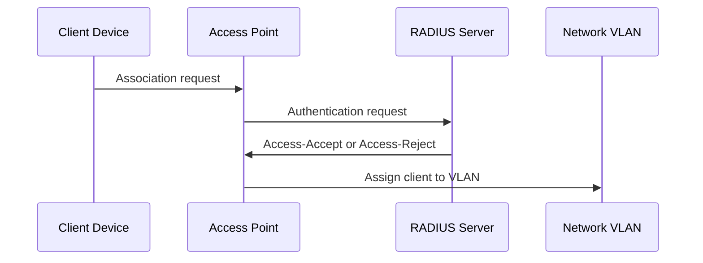

# Wireless Security Design

## SSID Plan

| SSID | VLAN | Authentication | Purpose |
|---|---:|---|---|
| Corp-WiFi | 10 | WPA2/WPA3-Enterprise | Employee devices |
| Guest-WiFi | 30 | Captive portal or PSK | Guest internet |
| IoT-WiFi | 40 | PSK or device-based control | IoT devices |

## Recommended Controls

- Use WPA2-Enterprise or WPA3-Enterprise for corporate Wi-Fi.
- Use RADIUS for centralized authentication where possible.
- Separate Guest-WiFi from internal networks.
- Separate IoT-WiFi from corporate devices.
- Disable WPS.
- Remove unused SSIDs.
- Rotate shared passwords when staff or vendor access changes.
- Review RADIUS authentication failures.

## 802.1X Authentication Flow

